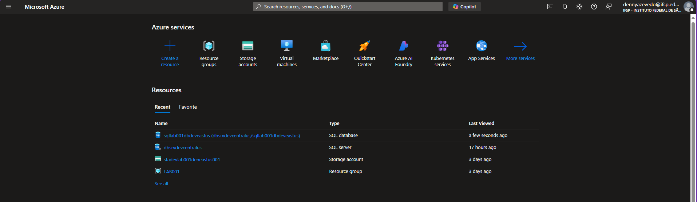
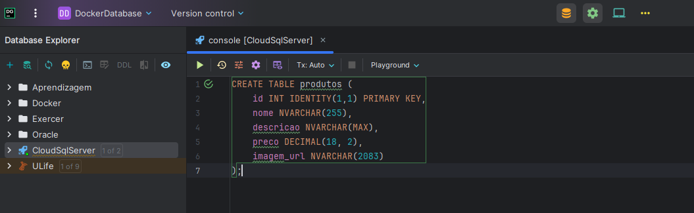
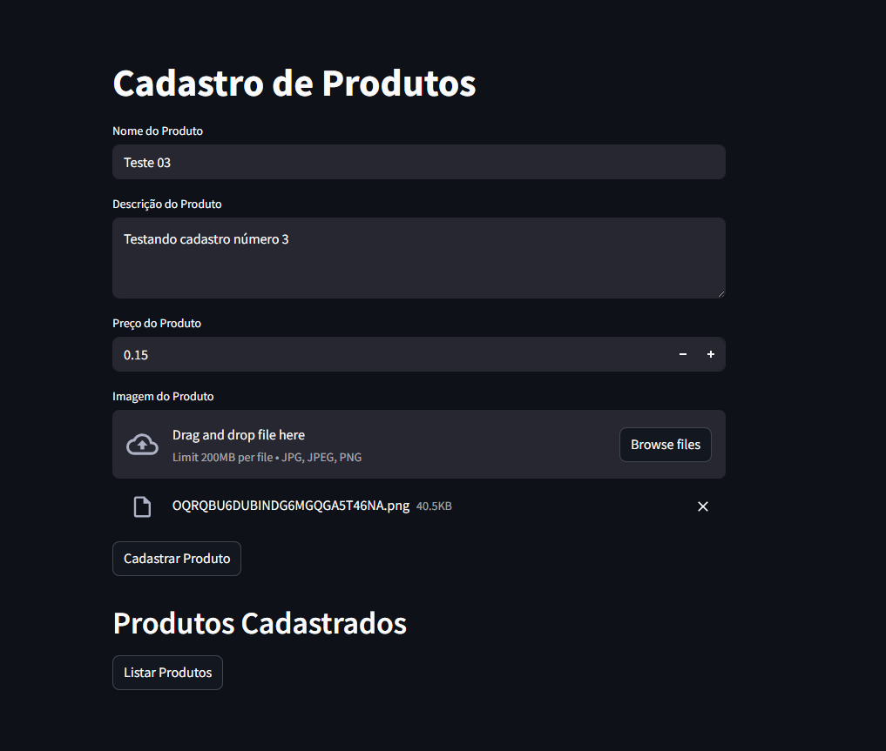
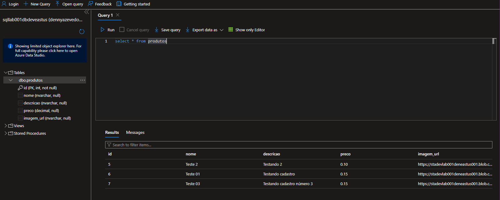
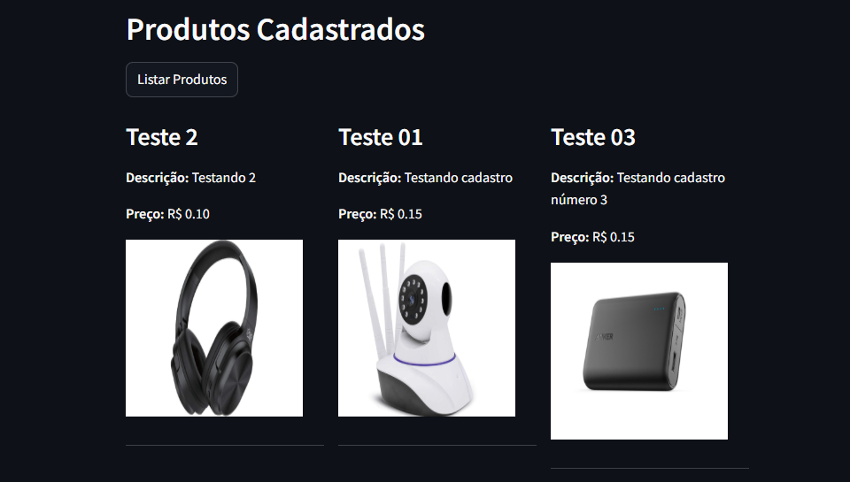

# 💻 Laboratorio 01

## 📚 Ações efetuadas

- Criado Resource Group
- Criado Storage Account
- Criado Sql Server
- Criado Sql Database
- Desenvolvido uma aplicação web simples em Python
- Testando a inclusão e listagem de dados no banco de dados SQL

## 🛠️ Ferramentas Utilizadas

- Portal Azure

- Visual Studio Code

  - Python
  - Packages:
    - streamlit
    - azure-storage-blob
    - pymssql
    - dotenv

- DataGrip da JetBrains

## 🎯 Resultados

- Tela do Portal Azure mostrando os recursos criados:

- Criando tabela no banco de dados SQL:

- Tela da aplicação web simples em Python:

- Tela do Portal Azure mostrando dados no banco de dados SQL:

- Tela da aplicação web mostrando lista de produtos:

