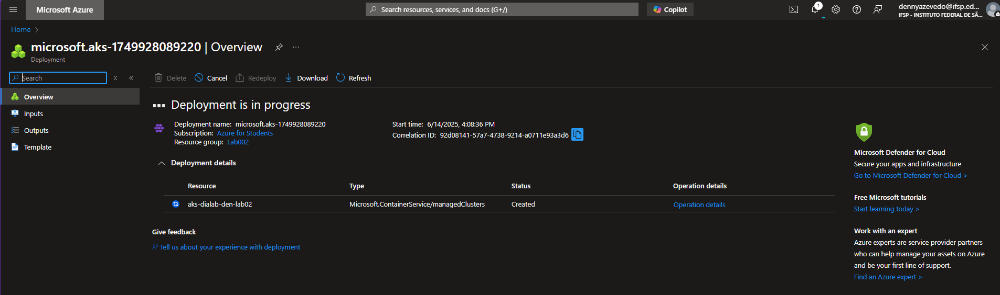
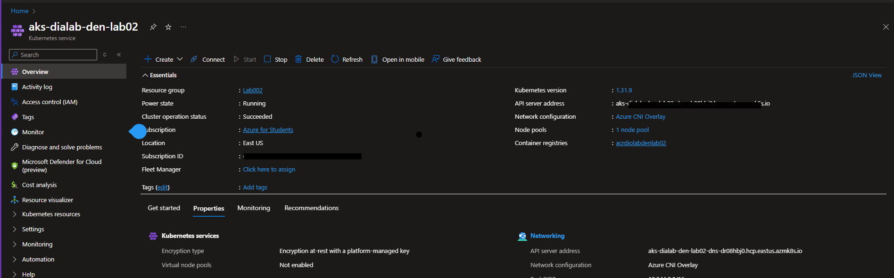
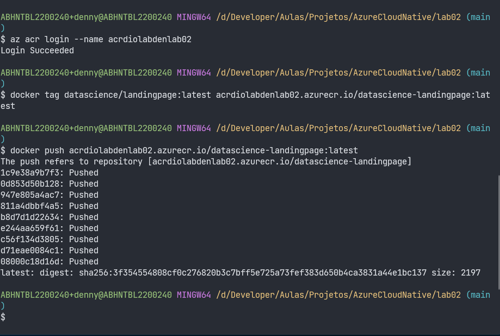
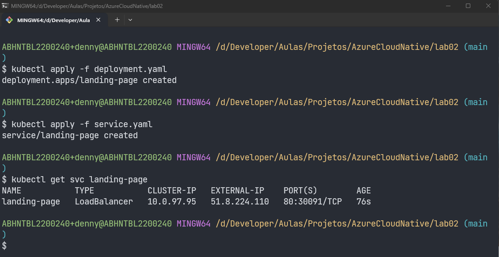
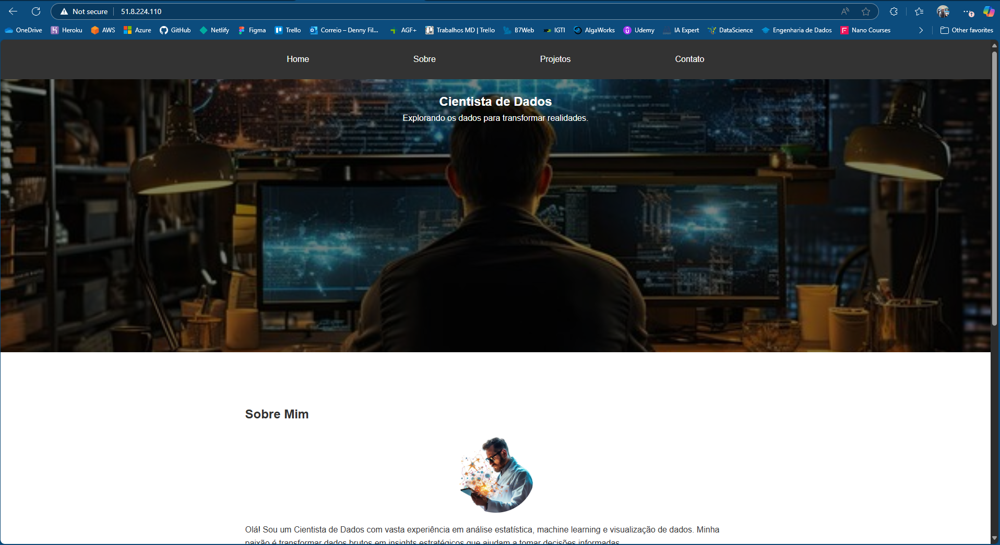

# 💻 Laboratorio 02

## 📚 Ações efetuadas

- Criado Resource Group
- Criado Container
- Criado AKS
- Criado Docker Image
- Desenvolvido uma aplicação web simples em HTML/CSS
- Criando Docker Image com a aplicação web - dockerfile
- Fazendo Push da imagem para o Container Registry
- Criando arquivos yaml para deploy da aplicação web no AKS
- Fazendo Deploy da aplicação web no AKS

## 🛠️ Ferramentas Utilizadas

- Portal Azure

- Visual Studio Code

## 🎯 Resultados

- Tela do Portal Azure mostrando a criação do AKS:

- Tela do Portal Azure mostrando AKS criado:

- Tela da aplicação web simples rodando do Docker Container local:

- Fazendo o push do Docker local para AKS:

- Ativando o AKS com os arquivos yaml:

- Tela da aplicação web simples rodando do AKS:

